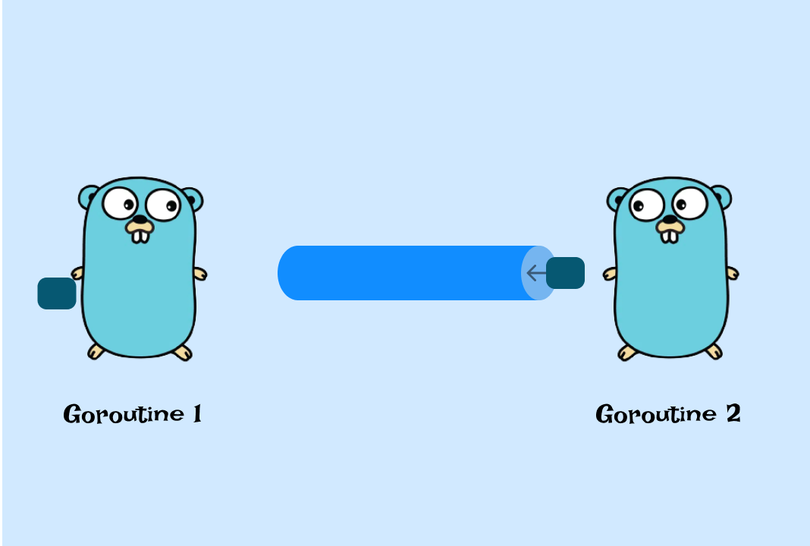

## Channels 

Channels in Go are a fundamental feature for communication and synchronization between multiple goroutines. They provide a two-way communication pipe, where data can be sent in from one end and received from the other end in the same order that it was sent.

 
