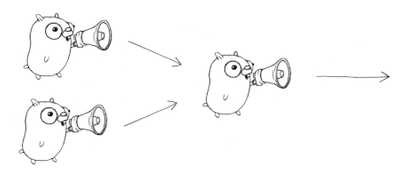

## Fan In Pattern

 The results produced by the concurrent goroutines or stages are collected and merged into a single output channel or data structure. This consolidation combines the individual results into a final result.

 
