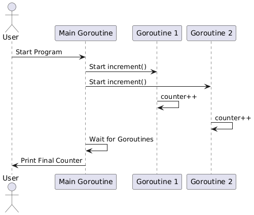

## Go Race conditions 
Race conditions are among the most insidious and elusive programming errors. They typically cause erratic and mysterious failures, often long after the code has been deployed to production. While Go’s concurrency mechanisms make it easy to write clean concurrent code, they don’t prevent race conditions.

### What is a race condition?
A race condition occurs when multiple threads try to access and modify the same data.


### The Go Race Detector

The Go race detector is an invaluable tool for identifying race conditions in your code. It works by dynamically analyzing your program to detect concurrent access to shared variables, where at least one access is a write. When a race condition is detected, the race detector provides detailed information about the conflicting accesses.

### Using the race detector
The race detector is fully integrated with the Go tool chain. To build your code with the race detector enabled, just add the -race flag to the command line:

```
go test -race mypkg    // test the package
go run -race mysrc.go  // compile and run the program
go build -race mycmd   // build the command
go install -race mypkg // install the package
```

### Interpreting Race Detector Output
When the race detector identifies a race condition, it outputs a detailed report that includes the following information:

1. Goroutine Stack Trace: The stack traces of the goroutines involved in the race condition.
2. Source Code Location: The exact lines of code where the conflicting accesses occurred.
3. Access Types: Whether the conflicting accesses are reads or writes.

### Common Signs of Race Conditions
Race conditions can manifest in various ways, often making them difficult to diagnose. Here are some common signs that your code might have a race condition:

1. Intermittent Bugs: Bugs that occur sporadically and are hard to reproduce consistently.
2. Unexpected Behavior: Program behavior that deviates from the expected outcome, especially under concurrent execution.
3. Crashes and Panics: Sudden crashes or panics that occur without a clear cause, often due to corrupted state.


## Common Causes of Race Conditions in Golang

### Shared vars 
One of the most common causes of race conditions is the improper handling of shared variables. When multiple goroutines access and modify the same variable concurrently without proper synchronization, it can lead to unpredictable behavior.



### Improper Use of Goroutines
Goroutines are lightweight threads managed by the Go runtime. While they are powerful, improper use can lead to race conditions. For example, launching goroutines without proper synchronization mechanisms can cause data races.
